# Arquitectura visual de GatoPago

**Fecha de corte:** 30 de agosto de 2026
**Estado:** Fase 3 App promovida con Google + Email Link y Passkey Security v2;
ejecución monetaria desactivada
**Propósito:** explicar el sistema con un único vocabulario y separar con claridad
lo que está desplegado, lo que está listo en código y lo que sólo es futuro.

Este directorio es el punto de entrada visual. No reemplaza al código,
`ARCHITECTURE.md`, `SECURITY.md` ni `DEPLOY.md`, y no autoriza por sí mismo un
despliegue.

## La arquitectura en una frase

GatoPago tiene **dos backends por dominio**, no un Worker por frontend:

1. **App Backend** administra identidad, smart accounts y operaciones personales.
2. **Payments Backend** administra comercios, links, intents, checkout,
   liquidación y webhooks.

El Dashboard es otro cliente web y Checkout es una ruta de App Web. No tienen
Worker propio. El control de corte dentro de App Backend es compatibilidad
temporal, no un tercer BFF.

## Vocabulario canónico

| Nombre que usamos | Nombre técnico | Responsabilidad |
|---|---|---|
| App | `client/` | Interfaz de personas y cuenta GatoPago. |
| Dashboard | `dashboard/` | Panel de comercios y desarrolladores. |
| Checkout | ruta pública de `client/` | Experiencia para pagar un link, incluso con wallet externa. |
| App Backend | carpeta `server/`; Worker remoto `server` | Identidad, passkeys, cuentas, UserOperations, Home, swaps, contactos y CCTP personal. |
| Payments Backend | carpeta `payments-worker/`; Worker remoto `gatopago-payments-api` | Comercios, links, intents, quotes, attempts, routing de cobro, settlement, eventos y webhooks. |
| App DB | binding `GATOPAGO_DB`; D1 `parmeliadb` | Datos propios del dominio App. |
| Payments DB | binding `PAYMENTS_DB`; D1 `gatopago-payments-semantic-20260826` | Datos propios del dominio Payments. La D1 `gatopago-payments` permanece sólo como histórico del primer corte. |
| App Jobs | Queue `parmelia-scheduled-jobs` | Indexación y trabajos de App. |
| Payments Jobs | Queue `gatopago-payment-jobs` | Reconciliación, CCTP y entregas de webhooks. |

Un *binding* es el nombre que ve el código. El nombre D1 o Queue es el recurso
que ve el operador en Cloudflare.

## Estado comprobado

| Elemento | Estado remoto actual |
|---|---|
| App Backend `server` | Desplegado. |
| App DB `parmeliadb` | Existe; todavía contiene también las tablas históricas de pagos. |
| App Jobs | Existen. |
| Payments Backend | `gatopago-payments-api` desplegado con capability/firma del payer, validación de receipt, CAS/expiry, Multicall3 y migración `0006`. |
| Payments DB | `gatopago-payments-semantic-20260826` activa con manifest v4/checksum semántico v2. `gatopago-payments` permanece intacta como evidencia histórica. |
| Payments Jobs | Queue y DLQ creadas; sin trabajos activos o terminales al cierre. |
| Migraciones App `0033` y `0034` | Aplicadas; App usa boundary v2 y modo `payments`. |
| Snapshot de partición | Import data-only ejecutado una vez: 4 merchants, 21 links y 21 intents. El checksum semántico cubre tablas, columnas y contenido; el export target se comparó antes de activar y el sync posterior dejó 7 merchants. |
| Cliente Vercel | `parmelia` sirve `https://app.parmelia.me`; el checkout usa únicamente el provider EIP-1193 que una extensión o el navegador integrado de la propia wallet ya expone. No integra proveedores externos de conexión. |
| Dashboard Vercel | `https://dashboard.parmelia.me` es accesible anónimamente y muestra el login de GatoPago; Vercel SSO está desactivado. |
| Routers de pago | Desplegados y verificados en testnets soportadas. No se activó mainnet. |
| Autenticación App candidata | Google + Firebase Email Link pasan localmente. `0035`, la nueva ruta y la CSP que habilita `apis.google.com` siguen pendientes en remoto; no usa Resend, SMTP ni OTP numérico. |

## Orden de lectura

1. [Contexto del sistema](./diagrams/01-contexto-sistema.puml) — quién usa
   GatoPago y qué sistemas externos participan.  
   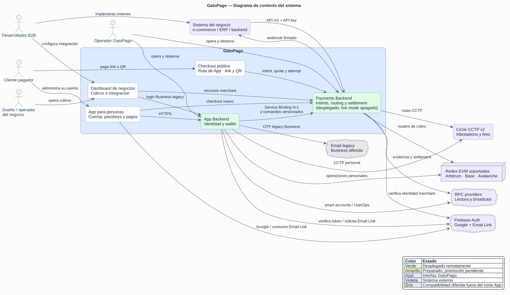
2. [C4 nivel 2: contenedores](./diagrams/02-c4-contenedores.puml) — cuáles son
   los dos backends, las dos D1 y sus clientes.  
   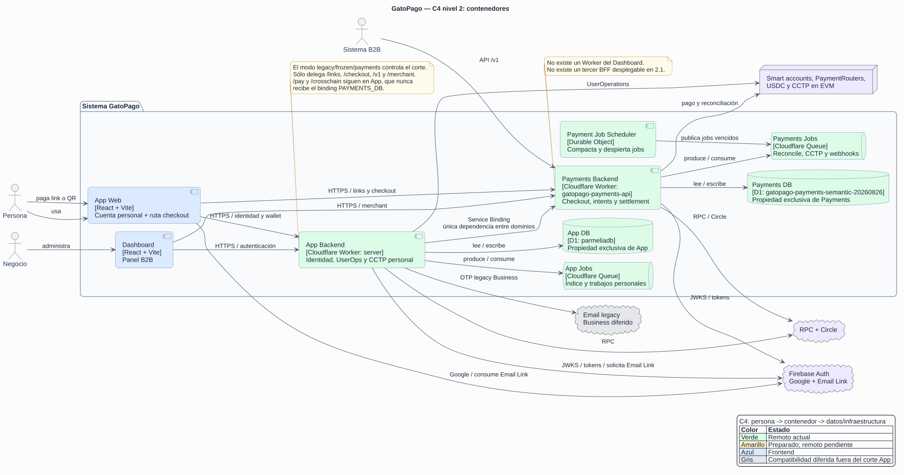
3. [C4 nivel 3: Payments](./diagrams/03-c4-componentes-payments.puml) — cómo se
   divide internamente el dominio de pagos.  
   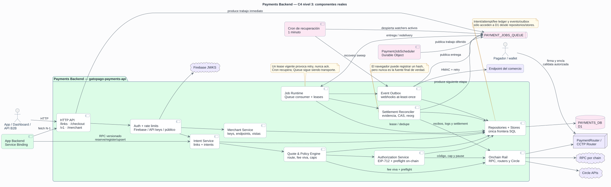
4. [Creación y ejecución del cobro](./diagrams/04-secuencia-creacion-y-ejecucion-cobro.puml)
   — intent, quote, attempt y broadcast sin declarar pago anticipadamente.  
   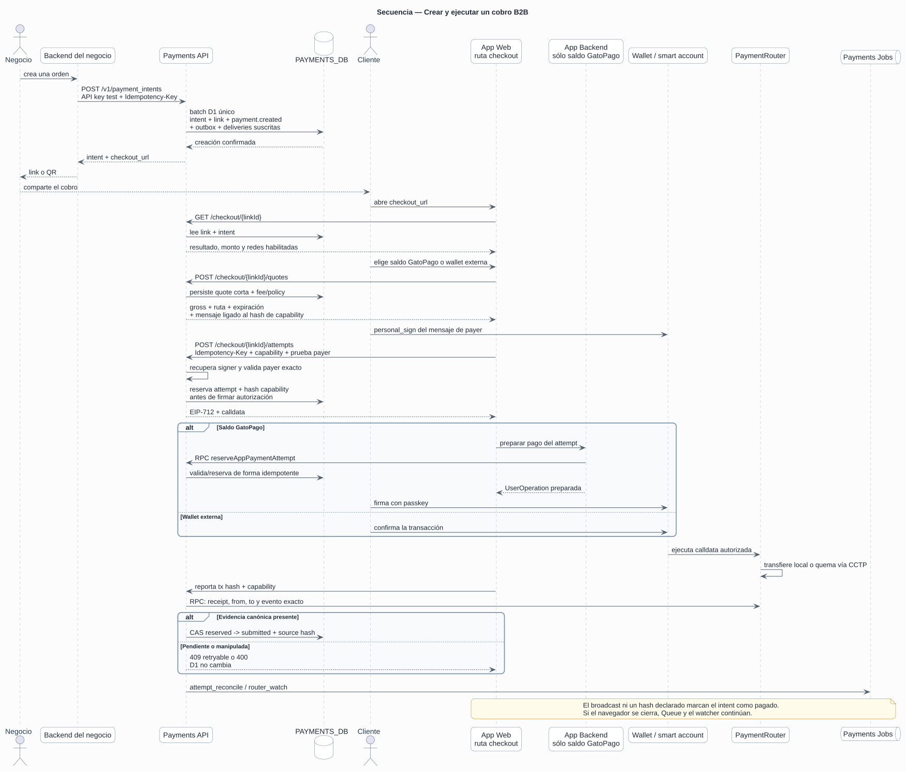
5. [Reconciliación y webhook](./diagrams/05-secuencia-reconciliacion-y-webhook.puml)
   — leases, evidencia local/CCTP, transición atómica y entrega firmada.  
   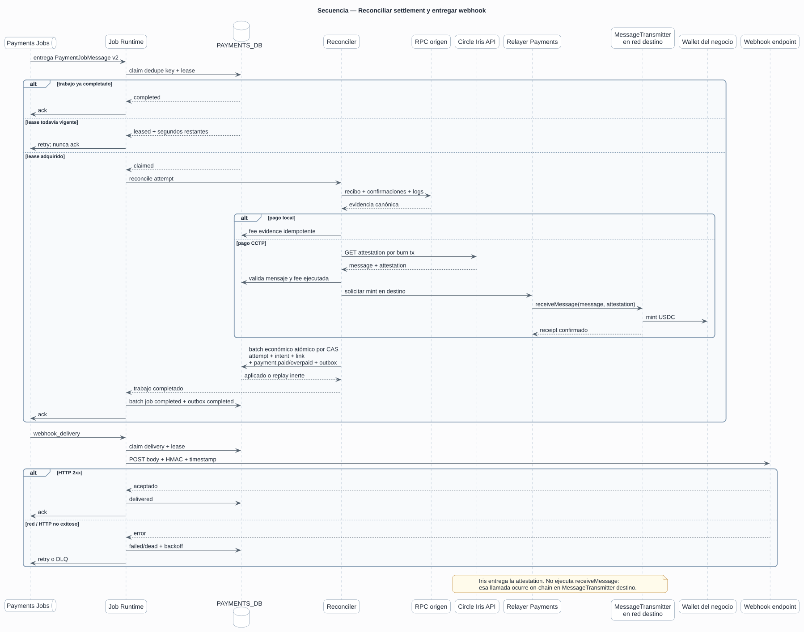
6. [Secuencia del corte 2.1](./diagrams/06-secuencia-corte-fase-2-1.puml) — qué
   se crea, migra y despliega, en qué orden y con qué gates.  
   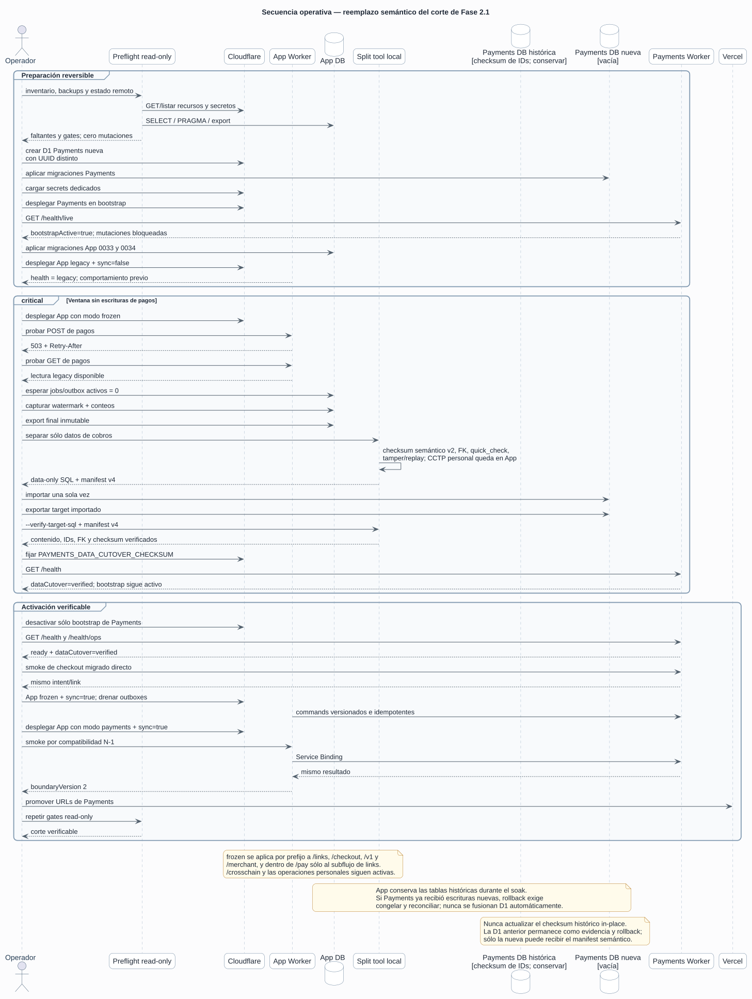
7. [Actividad de checkout universal](./diagrams/07-actividad-checkout-universal.puml)
   — cómo se elige la ruta sin exponer infraestructura al usuario.  
   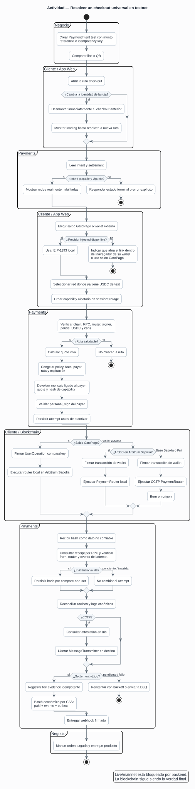
8. [Despliegue físico](./diagrams/08-despliegue-fase-2-1.puml) — Vercel,
   Cloudflare, D1, Queues, Durable Objects y redes.  
   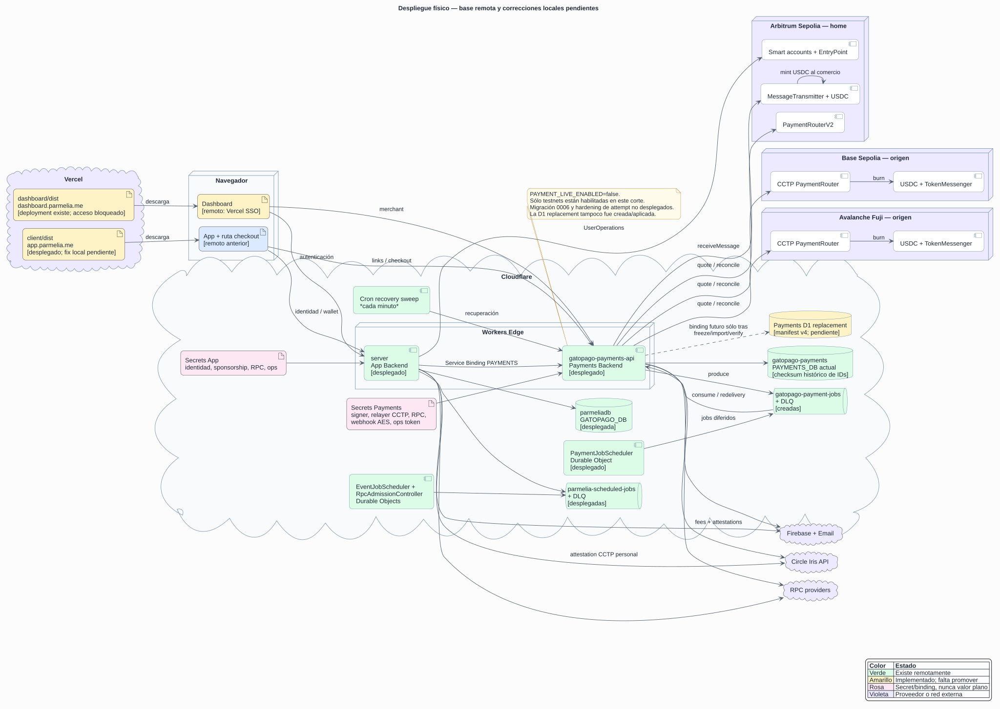
9. [Casos de uso B2B](./diagrams/09-casos-de-uso-b2b.puml) — lo que se ofrece
   al promover 2.1 y lo que sigue siendo una propuesta posterior.  
   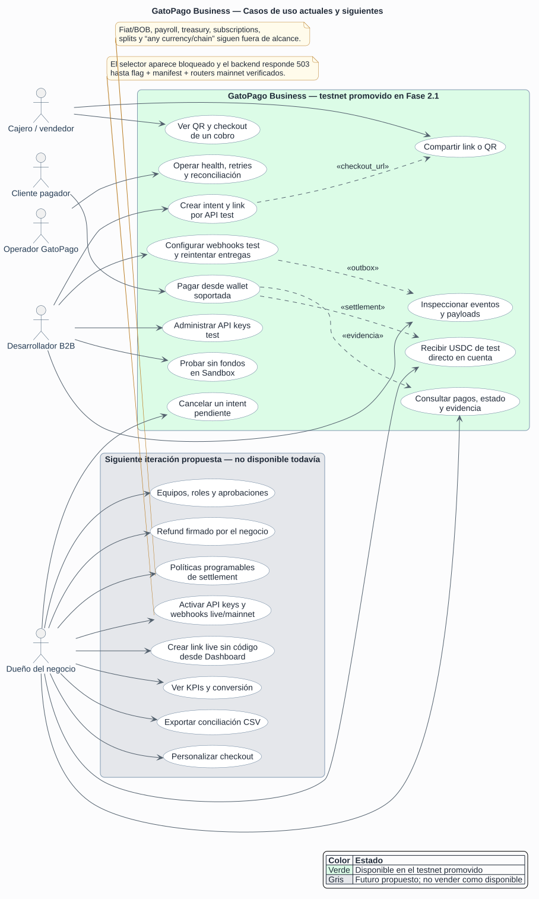
10. [Arquitectura escalable de proveedores](./diagrams/10-arquitectura-proveedores-escalable.puml)
    — núcleo actual y puertos/adapters que sólo se extraen al integrar un
    proveedor real.  
    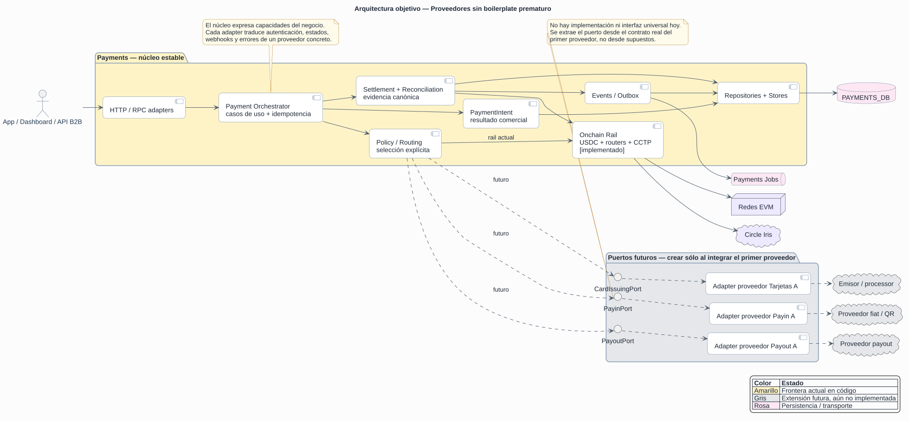
11. [Secuencia de magic link de la App](./diagrams/11-secuencia-magic-link-app.puml)
    — Google, Turnstile, solicitud/consumo de Email Link y recovery de un solo
    uso sin proveedor de correo adicional.
    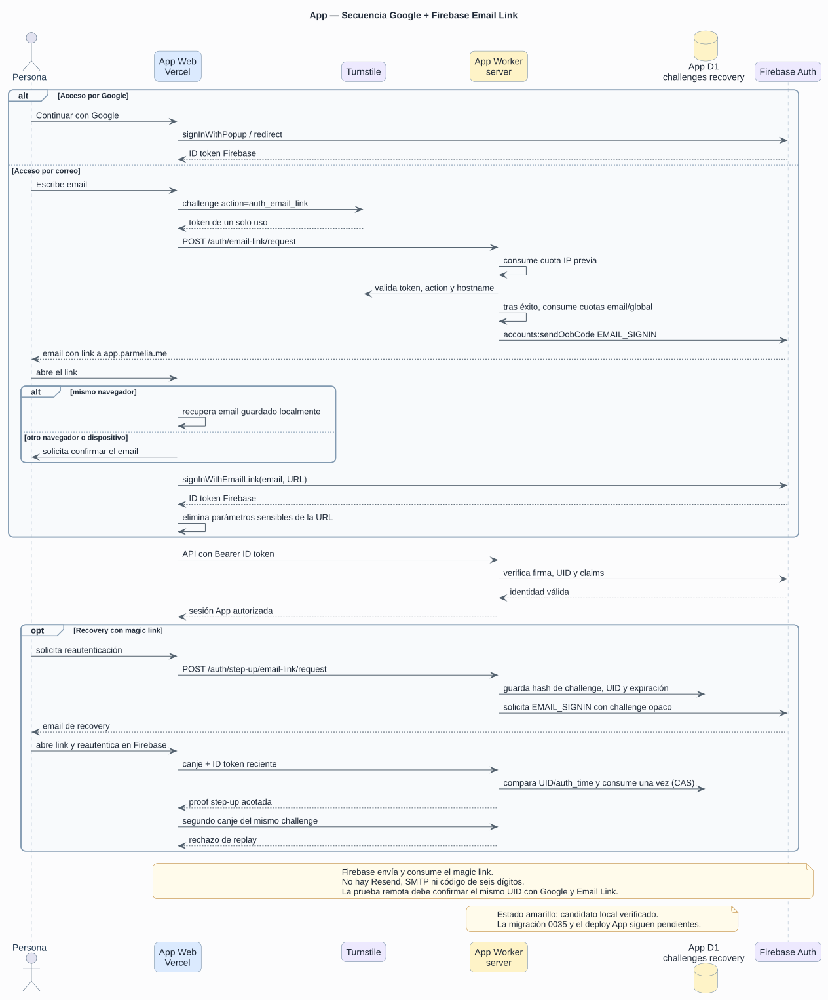

Las decisiones y fundamentos de esta corrección están en
[CORRECCIONES.md](./CORRECCIONES.md). El procedimiento operativo está en el
[runbook de cutover](../runbooks/payments-cutover.md); la producción histórica
debe pasar primero por el
[reemplazo semántico](../runbooks/payments-semantic-recut.md).
El corte histórico de autenticación está en el
[runbook de magic links](../runbooks/phase-3-app-magic-link-cutover.md); la
promoción vigente del modelo de llaves usa el
[runbook Passkey v2](../runbooks/phase-3-app-passkey-v2-cutover.md).

## Fronteras que no deben romperse

- App Backend puede llamar a Payments por un Service Binding versionado;
  Payments no llama a App.
- `/pay` y `/crosschain` son superficies App; sólo el pago de un link reservado
  cruza por RPC hacia Payments. El split nunca copia el CCTP personal.
- Cada Worker escribe únicamente su propia D1 y consume su propia Queue.
- Ningún deploy puede avanzar a doble escritura: los guards validan la máquina
  de estados y Payments vuelve a comprobar en D1 el checksum importado antes de
  HTTP/RPC mutante, Queue o Cron.
- Dashboard y la ruta Checkout llaman directamente a Payments para recursos de
  cobro; el proxy de App se conserva sólo durante la compatibilidad N-1.
- Un `PaymentIntent` expresa el resultado; quote, route, CCTP y UserOperation son
  pasos internos de ejecución.
- Estado y liquidación salen de evidencia on-chain reconciliada, no de lo que
  afirme el navegador.
- Un visitante sólo puede leer/registrar/cancelar su attempt con una capability
  aleatoria y prueba de la wallet cotizada. El hash no se persiste hasta que el
  backend verifica receipt, payer, router y evento.
- Cada transición económica y su evento/outbox se escriben atómicamente en
  Payments DB. No se simula una transacción entre dos D1.
- El comercio recibe USDC de test en Arbitrum Sepolia durante el primer corte.
  Base Sepolia y Fuji son redes de origen de pago, no copias completas de la App.
- `free-default` mantiene la comisión de plataforma en cero. El coste de red se
  registra aparte.

## Secretos sin jerga

Payments necesita dos claves blockchain y cuatro valores operativos:

| Grupo | Valores |
|---|---|
| Claves blockchain | Signer de autorizaciones (la dirección pública coincide con `wallet-0x75`) y relayer CCTP dedicado. |
| Acceso a infraestructura | RPC HTTPS por chain. |
| Protección de datos | Clave AES de webhooks y su identificador de rotación. |
| Operación | Token del healthcheck privado. |

No se copian a Payments las claves de usuarios, passkeys, guardian, OTP ni
paymaster de App. Los valores `VITE_*` son configuración pública de frontend, no
claves privadas.

## Alcance B2B de Fase 2.1

La promesa acotada es:

> Crear cobros por link, QR o API; aceptar USDC desde las redes soportadas;
> liquidar directamente en la cuenta del negocio; y reconciliar mediante
> dashboard, eventos y webhooks firmados.

No forman parte de 2.1: fiat/BOB, cualquier token, payroll, treasury automático,
subscriptions, splits, refunds automáticos, roles empresariales ni settlement
programable. Esos elementos aparecen en gris en casos de uso cuando sirven para
mostrar el siguiente límite, nunca como funcionalidad disponible.

## Renderizado

Los SVG se generan desde los `.puml`; no deben editarse manualmente. Java es
necesario. El script descarga una versión fijada de PlantUML a la carpeta
temporal, valida su SHA-256 y rechaza SVG que contengan mensajes de error:

```powershell
pnpm docs:architecture:render
pnpm docs:architecture:check
```
