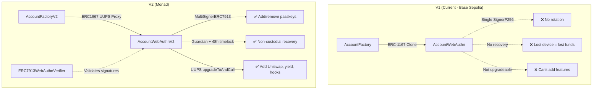

# Parmelia V2 — Walkthrough

## Changes Made

### New Contracts

| File | Purpose |
|------|---------|
| [AccountWebAuthnV2.sol](file:///Users/daniel/Desktop/test/parmelia-links/contracts/src/AccountWebAuthnV2.sol) | Multi-passkey smart account with guardian recovery and UUPS upgradeability |
| [AccountFactoryV2.sol](file:///Users/daniel/Desktop/test/parmelia-links/contracts/src/AccountFactoryV2.sol) | Factory deploying ERC1967 UUPS proxies via CREATE2 |
| [ERC7913WebAuthnVerifier.sol](file:///Users/daniel/Desktop/test/parmelia-links/contracts/src/ERC7913WebAuthnVerifier.sol) | Stateless WebAuthn P256 signature verifier (deploy once per chain) |
| [AccountWebAuthnV2.t.sol](file:///Users/daniel/Desktop/test/parmelia-links/contracts/test/AccountWebAuthnV2.t.sol) | 27 Foundry tests covering all V2 features |

### Modified Files

| File | Changes |
|------|---------|
| [ParmeliaPaymaster.sol](file:///Users/daniel/Desktop/test/parmelia-links/contracts/src/ParmeliaPaymaster.sol) | Replaced custom owner with `Ownable2Step` |
| [Deploy.s.sol](file:///Users/daniel/Desktop/test/parmelia-links/contracts/script/Deploy.s.sol) | Rewritten for V2 contract deployment |
| [shared/index.ts](file:///Users/daniel/Desktop/test/parmelia-links/shared/index.ts) | Added V2 ABI exports + `VERIFIER_ADDRESS` |
| [account.routes.ts](file:///Users/daniel/Desktop/test/parmelia-links/server/src/routes/account.routes.ts) | V2 MultiSigner initialization, safe passkey addition |
| [pay.routes.ts](file:///Users/daniel/Desktop/test/parmelia-links/server/src/routes/pay.routes.ts) | MultiSignerERC7913 signature wrapping format |

---

## How the 3 Problems Are Solved

### 1. Passkey Rotation (was: changing passkey = lost account forever)

**Before:** `initializeWebAuthn` used `initializer`, signer could only be set once.
**Now:** `MultiSignerERC7913` allows dynamic `addSigners`/`removeSigners` via signed UserOps. Add a new passkey, remove the old one — same wallet address, same funds.

### 2. Domain Change (was: new domain = all users lose accounts)

**Before:** Passkeys were bound to the RP ID (domain); no way to re-register.
**Now:** On-chain validation uses `qx, qy` coordinates — completely domain-agnostic. With multi-signer support, you can add a passkey from the new domain before migrating, then remove the old one.

### 3. Account Recovery (was: lost device = lost account permanently)

**Before:** No recovery mechanism existed.
**Now:** Guardian-based recovery with 48h timelock:
- Guardian (e.g. server EOA) proposes new signers → 48h countdown starts
- User can **cancel** within 48h using any active passkey
- After 48h, anyone can **execute** the recovery
- Guardian **cannot** move funds or sign transactions — only propose recovery

---

## Architecture: V1 vs V2



---

## Test Results

**27/27 tests pass** ✅

```
forge test -vvv
Ran 27 tests for test/AccountWebAuthnV2.t.sol:AccountWebAuthnV2Test
[PASS] test_factory_createAccount
[PASS] test_factory_predictAddress_deterministic
[PASS] test_factory_createAccount_idempotent
[PASS] test_factory_differentSigners_differentAddresses
[PASS] test_initialize_signerRegistered
[PASS] test_initialize_guardianSet
[PASS] test_initialize_cannotReinitialize
[PASS] test_implementation_cannotBeInitialized
[PASS] test_addSigners_fromSelf
[PASS] test_addSigners_onlyEntryPointOrSelf
[PASS] test_removeSigners_fromSelf
[PASS] test_setThreshold_fromSelf
[PASS] test_setGuardian_fromSelf
[PASS] test_setGuardian_onlyEntryPointOrSelf
[PASS] test_recovery_propose
[PASS] test_recovery_onlyGuardianCanPropose
[PASS] test_recovery_cannotProposeTwice
[PASS] test_recovery_cancel
[PASS] test_recovery_attackerCannotCancel
[PASS] test_recovery_cannotExecuteBeforeTimelock
[PASS] test_recovery_executeAfterTimelock
[PASS] test_recovery_canCancelDuringTimelock
[PASS] test_recovery_cannotExecuteWithoutProposal
[PASS] test_upgrade_fromSelf
[PASS] test_upgrade_onlyEntryPointOrSelf
[PASS] test_execute_onlyEntryPointOrSelf
[PASS] test_getSigners
```

---

## Next Steps Before Deploy

1. **Update [shared/index.ts](file:///Users/daniel/Desktop/test/parmelia-links/shared/index.ts) addresses** — after running `forge script script/Deploy.s.sol:DeployV2` on Monad, replace the placeholder `0x000...` addresses with the actual deployed ones.

2. **Update client [webauthn.ts](file:///Users/daniel/Desktop/test/parmelia-links/client/src/webauthn.ts)** — the [signWithPasskey](file:///Users/daniel/Desktop/test/parmelia-links/client/src/webauthn.ts#130-179) function needs to also return `qx, qy` so the server can build the ERC-7913 signer identifier. The passkey creation already returns these values; the signing flow needs them passed through to `/pay/submit`.

3. **Update chain configuration** — replace `baseSepolia` references in server routes with the Monad chain config.

4. **Update `Onboarding.tsx`** — the `POST /account/create` payload stays the same (`credentialId, qx, qy`), so the client onboarding should work as-is.

5. **Update `Settings.tsx`** — the "reset passkey" button should now call `PUT /account/passkey` which returns `addSignerCalldata`. This calldata needs to be sent as a UserOp signed by the current passkey to add the new passkey.

6. **EntryPoint address** — verify the EntryPoint v0.9 address on Monad matches the one in [Deploy.s.sol](file:///Users/daniel/Desktop/test/parmelia-links/contracts/script/Deploy.s.sol).
